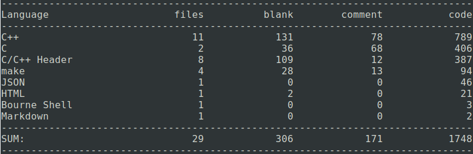

## SWINGS WebServer

---

## 简介
**SWINGS是用C++11实现的高性能Web服务器，可处理静态资源请求，支持HTTP长连接及超时断开** 

## 代码统计


## 开发工具
- **操作系统**： Ubuntu18.04LTS
- **编译器**： vim + vscode + sublime
- **编译器**： g++ 7.3.0
- **版本控制**： git
- **工程构建**： make
- **调试工具**： gdb
- **压测工具**： webbench

## 使用方式
```shell
git clone git@github.com:zhangwenxiao/swings.git
cd code
make
sh run.sh
```

## 技术要点
- 并发模型为Reactor
- 使用Epoll水平触发+EPOLLONESHOT，非阻塞IO
- 为充分利用多核CPU的性能，以多线程的形式实现服务器，并实现线程池避免线程频繁创建销毁造成的系统开销
- 实现基于小根堆的定时器，用于断开超时连接
- 实现可以自动增长的缓冲区，作为HTTP连接的输入和输出缓冲区

## 文档
| Part I | Part II | Part III | Part IV | Part V | Part VI | Part VIII | Part IX |
| :-: | :-: | :-: | :-: | :-: | :-: | :-: | :-: |
|[项目目的](./doc/项目目的.md)|[并发模型](./doc/并发模型.md)|[核心类](./doc/核心类.md)|[整体架构](./doc/整体架构.md)|[主要函数](./doc/主要函数.md)|[遇到的问题](./doc/遇到的问题.md)|[并发测试](./doc/并发测试.md)|[相关知识](./doc/相关知识.md)|
